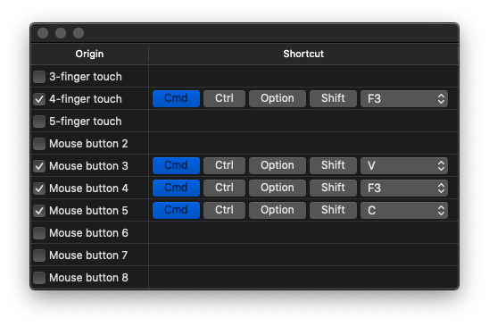

Noo
----

Noo allows you to map mouse buttons and multi-touch gestures to any combination of keys.

When working at a desk, I use [Evoluent mouse](https://evoluent.com/) which has 6 buttons. Here are the mappings I use:

* an extra mouse button to `Cmd + c` for copying
* an extra mouse button to `Cmd + v` for pasting
* an extra mouse button to `Cmd + F3` for activating [Tip](https://github.com/tanin47/tip) (a programmable tooltip on OS X)

When on the go, I use Noo to map 4-finger touch to `Cmd + F3` for activating [Tip](https://github.com/tanin47/tip). 

I strongly recommend investing in a mouse with extra buttons (e.g. [Evoluent mouse](https://evoluent.com/) with has 3 extra buttons and [Logitech G600](https://www.amazon.com/Logitech-Gaming-Backlit-Programmable-Buttons/dp/B0086UK7IQ/) with 12 extra buttons). 

These mouse are great for reducing hand movement that will reduce the risk of injury (e.g. [RSI](https://www.nhs.uk/conditions/repetitive-strain-injury-rsi/) and [Carpal tunnel syndrome](https://www.webmd.com/pain-management/carpal-tunnel/carpal-tunnel-syndrome#1)).

Installation
-------------

You can install it from the Mac App Store: https://apps.apple.com/us/app/noo-mouse/id1514904040

Noo needs access to the accessbility feature. You can grant it under "Security & Privacy".

Questions?
-----------

Please don't hesitate to open [a Github issue](https://github.com/tanin47/noo/issues).
